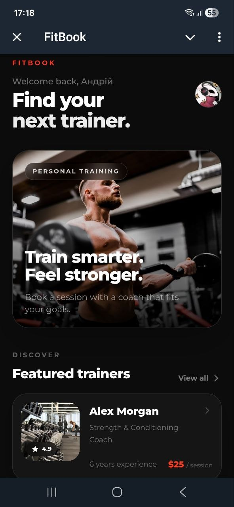
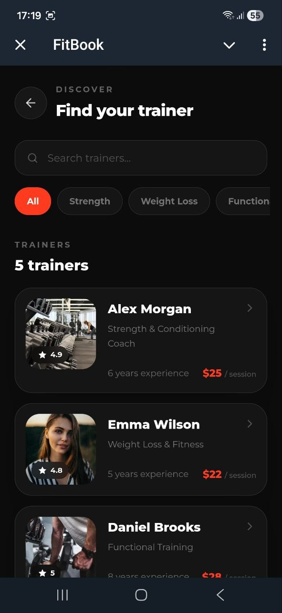
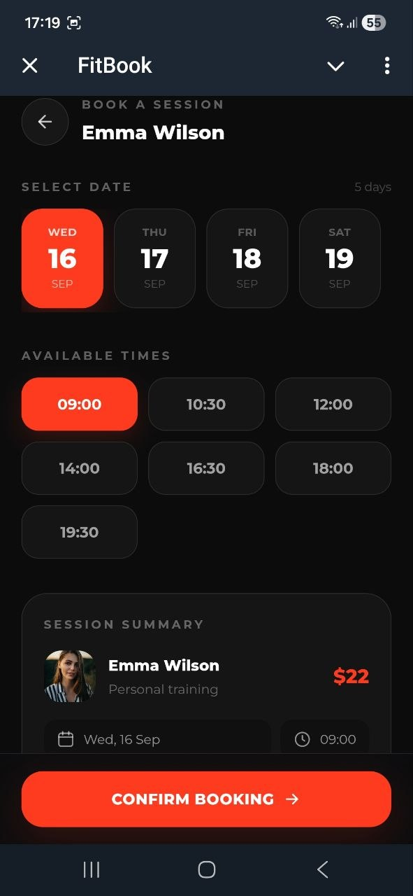
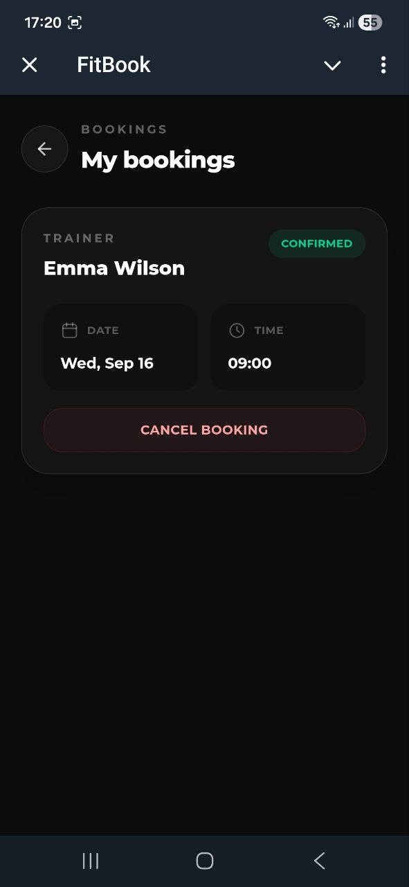

# FitBook

A Telegram Mini App for discovering personal trainers and booking training sessions.

## Preview

### Home



### Trainers



### Booking



### My Bookings



## Features

* Browse personal trainers
* Search trainers by name
* Filter trainers by specialization
* View detailed trainer profiles
* View trainer ratings, experience, and session count
* Check available training dates and times
* Book training sessions
* Booking confirmation screen
* View upcoming bookings
* Cancel bookings with confirmation
* Telegram user authentication
* Telegram profile photo and user information
* Loading and error states
* Responsive mobile-first UI

## Tech Stack

### Frontend

* React
* TypeScript
* Vite
* Tailwind CSS

### Backend

* Python
* FastAPI
* SQLAlchemy
* PostgreSQL
* Alembic

### Development

* Docker
* Docker Compose
* ngrok

## Booking Flow

```text
Home
  ↓
Trainers
  ↓
Search / Filter
  ↓
Trainer Profile
  ↓
Select Date
  ↓
Select Time
  ↓
Confirm Booking
  ↓
Booking Confirmation
  ↓
My Bookings
  ↓
Cancel Booking
```

## Telegram Integration

FitBook runs as a Telegram Mini App and uses Telegram `initData` to identify and authenticate users.

The backend validates the Telegram signature and `auth_date` before processing authenticated requests.

The authenticated Telegram user is used to associate bookings with the correct account.

## Booking System

Each trainer has their own availability slots.

When a user books a session, the backend checks whether the selected time slot has already been booked.

Confirmed bookings are excluded from the available slots shown to users.

Users can view their confirmed bookings and cancel them from the My Bookings section.

## Database

PostgreSQL is used for persistent application data.

Main entities:

```text
Trainer
   │
   ├── Availability
   │
   └── Booking
```

Alembic is used to manage database schema migrations.

## API

Main endpoints:

```text
GET    /trainers
GET    /trainers/{trainer_id}/availability

POST   /bookings
GET    /bookings
DELETE /bookings/{booking_id}

POST   /auth/telegram
```

Development endpoints for creating trainers and availability are also available through Swagger.

## Project Structure

```text
FitBook/
│
├── backend/
│   ├── app/
│   │   ├── db/
│   │   ├── models/
│   │   ├── main.py
│   │   ├── config.py
│   │   └── telegram_auth.py
│   │
│   ├── alembic/
│   ├── alembic.ini
│   └── Dockerfile
│
├── frontend/
│   ├── src/
│   ├── public/
│   ├── package.json
│   └── vite.config.ts
│
├── screenshots/
│   ├── home.jpg
│   ├── trainers.jpg
│   ├── booking.jpg
│   └── bookings.jpg
│
├── docker-compose.yml
├── .gitignore
└── README.md
```

## Running Locally

### Backend

From the `backend` directory:

```bash
docker compose up
```

Run database migrations:

```bash
python -m alembic upgrade head
```

The API will be available at:

```text
http://localhost:8000
```

Swagger documentation:

```text
http://localhost:8000/docs
```

### Frontend

From the `frontend` directory:

```bash
npm install
npm run dev
```

The frontend will be available at:

```text
http://localhost:5173
```

For Telegram Mini App testing, the frontend can be exposed through ngrok.

## Environment Variables

The backend uses environment variables for configuration.

Example:

```env
TELEGRAM_BOT_TOKEN=your_bot_token
FRONTEND_URL=your_frontend_url
```

The frontend uses:

```env
VITE_API_URL=your_backend_url
```

Do not commit `.env` files, bot tokens, passwords, or other secrets to the repository.

## What This Project Demonstrates

This project demonstrates:

* Full-stack application development
* React and TypeScript
* FastAPI REST API development
* PostgreSQL database integration
* SQLAlchemy ORM
* Alembic migrations
* Telegram Mini Apps
* Telegram authentication
* Docker-based development
* Booking and availability logic
* Search and filtering
* Responsive mobile UI
* Loading, error, and confirmation states

## Status

FitBook is a portfolio project demonstrating a complete personal training booking experience inside a Telegram Mini App.
